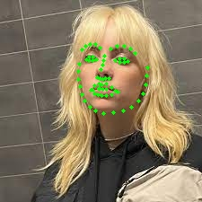

# PIPELINE TRAIN

1. An image is selected.
2. The face is detected using `dlib.get_frontal_face_detector()`.
3. Using the model `dlib_face_recognition_resnet_model_v1.dat`, 5 or 68 landmarks are found from the face.

        

4. Enconding the landmarks, 128 values are generated.
5. These values are used to compose a KNN.
6. KNN is "trained" using the 128 values of each face.
7. KNN uses the ball_tree algorithm and weighted distance.
8. The model is saved.

# PIPELINE TEST

1. An image is selected.
2. The face is detected using `dlib.get_frontal_face_detector()`.
3. Using the model `dlib_face_recognition_resnet_model_v1.dat`, 5 or 68 landmarks are found from the face.
4. The KNN model is used to find the best matches for the test face.
5. Either classification is selected as True or False using the threshold.
6. The prediction is shown.
